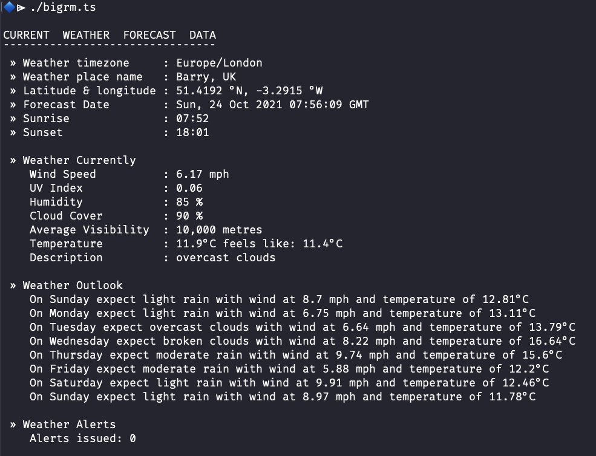

[](https://raw.githubusercontent.com/hyperium/hyper/master/LICENSE)
[](https://github.com/wiremoons/bigrm/releases)
[](https://github.com/denoland/deno)

# bigrm

Deno app to obtain the latest weather forecast for a given location on earth.

`bigrm` : _big room_ as in outside.



## Main features of bigrm

The program is written to run in a terminal window and check for the current
weather forecast at the user supplied location. Main features include:

- to be added.

**NOTE: a free OpenWeather API is needed to use the program.** To sign up and
obtain an API key use the OpenWeather web page here for more details of the
options available: https://openweathermap.org/price

## Downloading

Download the program to your computer - the simplest method is to clone this
GitHub repo with `git` as below:

```console
git clone https://github.com/wiremoons/bigrm.git
```

The program is the _TypeScript_ file named: `bigrm.ts`. See below for options on
how to run it.

## Running the program

The program can be run either as a Deno script or as a self contained compiled
program. See information below if needed on **Installing Deno**.

Once the GitHub repo is cloned to you computer, ensure you are in its directory
first.

On operating systems such as _Linux_, _macOS_, and _WSL_ the program can be
executed as a script directly. Just ensure the `bigrm.ts` is made executable
(see `chmod` command below), and then run it directly with: `./bigrm.ts`

```console
chmod 755 bigrm.ts
```

The program can be run with _Deno_ using the command:

```console
deno run --quiet --allow-net=api.openweathermap.org --location https://wiremoons.com/bigrm ./bigrm.ts
```

NOTE: the ability to compile the program is not possible due to
[Deno Bug #10693](https://github.com/denoland/deno/issues/10693). Once this is
fixed, the program can be compiled with _Deno_ using the command:

```console
deno compile --quiet --allow-net=api.openweathermap.org --location https://wiremoons.com/bigrm ./bigrm.ts
```

### Installing Deno

First ensure you have installed a copy of the `deno` or `deno.exe` program, and
it is in your operating systems path. See the relevant
[Deno install instruction](https://github.com/denoland/deno_install) or just
download the
[Deno latest release version](https://github.com/denoland/deno/releases)
directly.

Install is easy as it is just a single binary executable file - just download a
copy and add it to a directory in your path.

## Development Information

The application in written using the _Deno_ runtime and the _TypeScript_
programming language, so can be used on any operating systems support by _Deno_,
such as _Windows_, _Linux_, _macOS_, etc. More information about Deno is
available here:

- [Deno's web site](https://deno.land/)
- [Deno on GitHub](https://github.com/denoland)

## Licenses

The `bigrm` application is provided under the _MIT open source license_. A copy
of the MIT license file is [here](./LICENSE).

The [OpenWeather API](https://openweathermap.org/api) information is provided
for non commercial use via the _under Creative Commons Attribution-ShareAlike
4.0 International licence (CC BY-SA 4.0)_ license. A copy of the license file is
[here](https://creativecommons.org/licenses/by-sa/4.0/). See the
[OpenWeather FAQ 'License' section](https://openweathermap.org/faq) for more
details.
